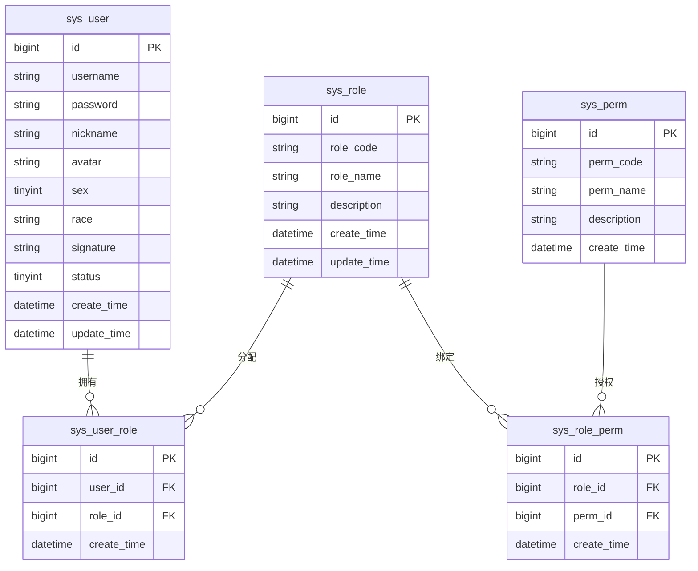
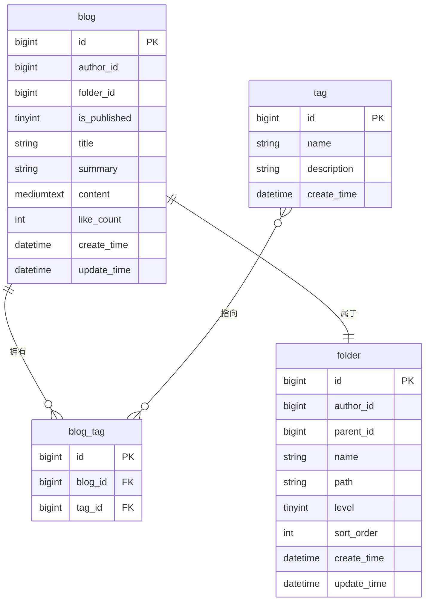
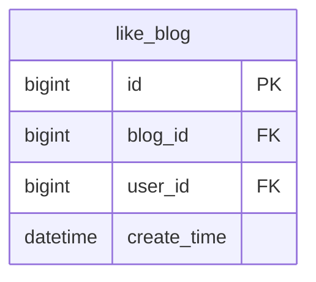

## 文档信息

|   项目   |   内容   |
| :------: | :-------: |
| 产品名称 | 彼岸论坛 |
|  版本号  |  v0.3.0  |
| 文档状态 |   草稿   |
|   作者   |  Nobeta  |
| 创建日期 | 2026-5-16 |
| 最后更新 | 2026-5-25 |

---

## 1. 背景目标

### 1.1 项目背景

项目 v0.2 版本将项目提到了实现基本用户认证、博客编写的功能实现，跑通了核心业务流。

但随着系统的试运行，暴露出了存在如下若干技术与业务痛点：

- 后端代码结构混乱，不够标准化
- 没有缓存，服务器压力大
- 认证系统松散
- 点赞功能实现，进一步完善用户画像构筑
- 不明所以的小标题系统

### 1.2 业务目标

本次 v0.3.0 版本的核心目标为 **构筑安全、性能基建，健全笔记/论坛架构**：

0. **后端重构**：使代码库架构规范化。
1. **认证重构**：全面引入 `Spring Security`，采用 `AccessToken` + `RefreshToken` 的双 Token 无感刷新方案。
2. **性能优化**：引入 `Redis` 作为缓存中间件，减轻数据库压力，用于存储 Token 黑白名单与高频热点数据。
3. **功能完善**：实现完整的点赞逻辑。
4. **目录系统**：将"小标题"设计重构为笔记式目录架构设计，并就此优化前端展示。
5. **tag 系统**：将“大标题”设计重构为全局多标签。
6. **前端修改**：实现提升前端编辑体验的若干功能与新结构展示。

## 2. 用户角色说明

| 角色         | 描述             | 核心诉求                                                   |
| ------------ | ---------------- | ---------------------------------------------------------- |
| **访客**     | 未登陆用户       | 浏览社区首页、检索内容、访问公开博客                       |
| **普通用户** | 注册并激活的用户 | 创作、管理文章；管理个人目录树、点赞互动；修改个人信息     |
| **管理员**   | 社区管理者       | 拥有全站的审查/删除权限、封禁违规用户、管理全局 Tag 标准化 |

## 3. 功能需求

### 3.1 功能清单

| 优先级 |    功能模块    |        功能点        |                              描述                              |
| :----: | :------------: | :-------------------: | :------------------------------------------------------------: |
|   P0   |  **代码重构**  |     后端代码重构     |            将当前劣质的三层架构与 Mapper 写法改善。            |
|   P0   | **安全与认证** | Spring Security 集成 | 替换旧有过滤器/拦截器，接管全局认证与授权，与后端代码重构耦合 |
|   P0   |                | 双 Token 登陆刷新机制 |      采用`AceessToken` 和 `RefreshToken` 的双 Token 机制      |
|   P1   |  **核心业务**  |       点赞系统       |                        设计博客点赞系统                        |
|   P2   |                |  小标题重构目录系统  |                  修改小标题业务逻辑到目录系统                  |
|   P1   |                |  大标题重构 tag 系统  | 修改大标题业务逻辑到多 tag 系统，实现 MVP 版本，不做后台管理。 |
|   P1   |  **性能基建**  |    Redis 缓存集成    | 高频数据，如主页文章列表、文章详情、未过期 Token 的黑名单缓存 |
|   P3   |  **前端修改**  |  目录、tag 系统适应  |                  前端适应项目的目录、tag系统                  |
|   P3   |                |     若干编辑体验     |                 修改编辑器，适应代码编辑体验。                 |

### 3.2 详细功能描述

#### 3.2.1 后端代码重构

存在数据库增表、业务字段修改，需要彻底重构。

**1. 数据库**

*用户表基于 RBAC 重设计：*



初始数据设计如下：

- **Role**
  - `ROLE_ADMIN` : 管理员；系统管理员，拥有用户管理、其他用户博客、系统管理权限。
  - `ROLE_USER` : 普通用户；拥有个人管理、个人博客管理权限。
- **Perm**
  - 个人用户管理权限 `user:edit_profile` 。
  - 个人博客管理权限 `blog:create`, `blog:update` , `blog:delete` 。
  - 用户管理权限 `user:ban` 。
  - 系统管理权限 `admin:manage` 。

*博客-目录-tag 表*

> 属性修改：去除 `bloguid` ，原先职责全部转向 `id` ，使用雪花算法生成 blogid



**2. 目录骨架**

原先目录层级为纯领域分层 (所有 Controller 一个包)，在项目膨胀后单包体积过大，管理调用不便。

1. 混合分包：横切关注点，如 `common/` 、`config/`、`security/` 等，全局唯一；纵向业务切片，如 `module/user/` 、`module/role` 每个模块自治 (controller/service/mapper/dto/vo/entity)。
2. 模块间调用走 Service 接口，禁止直接调用 Mapper。

```plaintext
src/main/java/online/faramita/bbs/
├── BbsApplication.java
│
├── common/                          # 全局通用，跨模块共享
│   ├── constant/                    # 常量类
│   │   ├── AuthConstant.java        # Token相关常量
│   │   └── MessageConstant.java     # 响应消息常量
│   ├── enums/                       # 枚举
│   │   ├── UserStatus.java          # 用户状态枚举
│   │   └── BlogStatus.java          # 博客状态枚举
│   ├── exception/                   # 自定义异常
│   │   ├── BaseException.java
│   │   ├── AccountException.java
│   │   ├── FileException.java
│   │   └── ResourceNotFoundException.java
│   ├── result/                      # 统一响应包装
│   │   ├── Result.java
│   │   └── PageVO.java              # 分页VO，配合 Result<PageVO<T>> 使用
│   └── util/                        # 通用工具类
│       ├── SnowflakeUtil.java       # 封装Hutool雪花ID
│       └── GithubFileUtil.java
│
├── config/                          # 全局配置类
│   ├── MyBatisConfig.java
│   ├── RedisConfig.java             # Redis序列化等配置
│   ├── SpringDocConfig.java         # OpenAPI文档
│   ├── WebMvcConfig.java            # 跨域、静态资源等
│   └── properties/                  # 配置属性绑定类
│       ├── JwtProperties.java       # @ConfigurationProperties
│       └── GithubProperties.java
│
├── security/                        # Spring Security 专属模块
│   ├── SecurityConfig.java          # SecurityFilterChain 配置
│   ├── filter/
│   │   └── JwtAuthenticationFilter.java  # OncePerRequestFilter
│   ├── handler/
│   │   ├── LoginSuccessHandler.java
│   │   ├── LoginFailureHandler.java
│   │   ├── AccessDeniedHandlerImpl.java
│   │   └── AuthEntryPoint.java      # 未认证入口点
│   ├── service/
│   │   └── UserDetailsServiceImpl.java   # 加载用户+角色+权限
│   └── util/
│       └── JwtUtil.java             # Token生成/解析/刷新
│
├── module/                          # 业务模块（按领域划分）
│   ├── user/
│   │   ├── controller/
│   │   │   └── UserController.java
│   │   ├── service/
│   │   │   ├── UserService.java
│   │   │   └── UserServiceImpl.java
│   │   ├── mapper/
│   │   │   └── UserMapper.java
│   │   ├── dto/
│   │   │   ├── RegisterDTO.java
│   │   │   ├── LoginDTO.java
│   │   │   └── ProfileDTO.java
│   │   ├── vo/
│   │   │   ├── LoginVO.java
│   │   │   └── ProfileVO.java
│   │   └── entity/
│   │       └── User.java
│   │
│   ├── role/                        # RBAC角色/权限管理
│   │   ├── controller/
│   │   │   └── RoleController.java
│   │   ├── service/
│   │   │   ├── RoleService.java
│   │   │   └── RoleServiceImpl.java
│   │   ├── mapper/
│   │   │   ├── RoleMapper.java
│   │   │   └── PermissionMapper.java
│   │   └── entity/
│   │       ├── Role.java
│   │       ├── Permission.java
│   │       ├── UserRole.java
│   │       └── RolePermission.java
│   │
│   ├── blog/
│   │   ├── controller/
│   │   │   └── BlogController.java
│   │   ├── service/
│   │   │   ├── BlogService.java
│   │   │   └── BlogServiceImpl.java
│   │   ├── mapper/
│   │   │   └── BlogMapper.java
│   │   ├── dto/
│   │   │   ├── BlogCreateDTO.java
│   │   │   ├── BlogUpdateDTO.java
│   │   │   └── BlogPageQueryDTO.java
│   │   ├── vo/
│   │   │   ├── BlogBaseVO.java
│   │   │   ├── BlogPublicDetailVO.java
│   │   │   ├── BlogPrivateBriefVO.java
│   │   │   ├── BlogPrivateDetailVO.java
│   │   │   ├── AuthorBriefVO.java
│   │   │   └── TagBriefVO.java
│   │   └── entity/
│   │       └── Blog.java
│   │
│   ├── folder/                      # 用户私有目录
│   │   ├── controller/
│   │   │   └── FolderController.java
│   │   ├── service/
│   │   │   ├── FolderService.java
│   │   │   └── FolderServiceImpl.java
│   │   ├── mapper/
│   │   │   └── FolderMapper.java
│   │   ├── dto/
│   │   │   ├── FolderCreateDTO.java
│   │   │   ├── FolderRenameDTO.java
│   │   │   ├── FolderMoveDTO.java
│   │   │   └── BlogsMoveDTO.java
│   │   ├── vo/
│   │   │   └── FolderTreeVO.java
│   │   └── entity/
│   │       └── Folder.java
│   │
│   ├── tag/
│   │   ├── controller/
│   │   │   └── TagController.java
│   │   ├── service/
│   │   │   ├── TagService.java
│   │   │   └── TagServiceImpl.java
│   │   ├── mapper/
│   │   │   ├── TagMapper.java
│   │   │   └── BlogTagMapper.java
│   │   ├── dto/
│   │   │   └── TagCreateDTO.java
│   │   ├── vo/
│   │   │   └── TagVO.java
│   │   └── entity/
│   │       ├── Tag.java
│   │       └── BlogTag.java
│   │
│   └── file/
│       ├── controller/
│       │   └── FileController.java
│       ├── service/
│       │   ├── FileService.java
│       │   └── FileServiceImpl.java
│       └── mapper/
│           └── FileMapper.java
│
├── handler/                         # 全局切面处理
│   └── GlobalExceptionHandler.java  # @RestControllerAdvice
│
└── task/                            # 定时任务
    ├── AvatarCleanupTask.java
    └── LikeFlushTask.java           # 点赞10s异步落盘


src/main/resources/
├── application.yml
├── application-dev.yml
├── application-prod.yml
├── mapper/                          # MyBatis XML（按模块对应）
│   ├── UserMapper.xml
│   ├── RoleMapper.xml
│   ├── PermissionMapper.xml
│   ├── BlogMapper.xml
│   ├── FolderMapper.xml
│   ├── TagMapper.xml
│   └── BlogTagMapper.xml
└── sql/                             # DDL脚本（版本管理用）
    └── v0.3.0_init.sql
```

#### 3.2.2 Redis 集成

增加依赖项 `spring-boot-starter-data-redis` ，引入基于 Lettuce 底层客户端的 Redis 配置。

v0.3.0 采用单机 Redis 设置。

```yaml
spring:
  data:
    redis:
      host: 127.0.0.1
      port: 6379
      password: your_password
      database: 0
      # 连接超时
      connect-timeout: 3000ms
      # 命令执行超时
      timeout: 3000ms

      # Lettuce 连接池配置
      lettuce:
        pool:
          max-active: 16       # 最大连接数
          max-idle: 8          # 最大空闲连接
          min-idle: 4          # 最小空闲连接（保持预热）
          max-wait: 1000ms     # 获取连接最大等待时间，超时报错
```

统一 RedisTemplate 使用 String 为 Key，JSON 为 Value。

详情参见 [Redis 进阶 - Faramita BBS](https://faramita.online/bbs/blog/1775011802d47a7e481bcf4721a7573ee56a5849cd) 。

#### 3.2.3 安全认证机制

摒弃原有的 `JwtTokenInterceptor` ，改为以下 Spring Security Filter 链：

- **`SecurityFilterChain`**：
  - 位置：`security/config/SecurityConfig.java`
  - 关键设计点：
    - `csrf().disable()` —— 无状态 JWT 不需要 CSRF
    - 在标准认证过滤器前插入 JWT 过滤器
- `JwtAuthenticationFilter`：
  - 位置：`security/filter/JwtAuthenticationFilter.java`
  - 继承：`OncePerRequestFilter`

> token 为空时不直接返回 401，部分公开博客允许匿名访问。
> 
> Spring Security 指导文档见：[Spring Security - Faramita BBS](https://faramita.online/bbs/blog/177885110188322999e92344d7a0e9511c1b3d39ca)

**指导清单：**

1. 引入 `spring-boot-starter-security` 依赖
2. 创建 `JwtProperties`（双 token 配置）
3. 重写 `JwtUtil`（支持 access/refresh 双模式，加入 jti 生成）
4. 实现 `UserDetailsServiceImpl`
5. 实现 `JwtAuthenticationFilter`
6. 配置 `SecurityConfig`（SecurityFilterChain + 异常处理器）
7. 实现 `AuthController`（login/refresh/logout 三个端点）
8. Redis 存储逻辑（refresh token 存取 + blacklist）
9. 删除旧的 `JwtTokenInterceptor` + `WebMvcConfiguration` 中的拦截器注册
10. 在 Service 层将 `BaseContext.getCurrentId()` 逐步迁移到 `SecurityUtils.getCurrentUid()`

*不再使用 BaseContext，完全转向 SecurityContextHolder。*

**异常处理**：要求自定义实现两个异常入口

| 异常                       | 触发时机                 | 返回码 |
| -------------------------- | ------------------------ | ------ |
| `AuthenticationEntryPoint` | 未认证，访问需要认证资源 | 401    |
| `AccessDeniedHandler`      | 已认证，权限不足         | 403    |

> 接口参见 [接口信息](#41-接口信息)

#### 3.2.4 目录系统

目录系统采用 **邻接表 + 物化路径** 混合模型，核心约束：

- 目录为**用户私有**（`author_id` 隔离），每个用户拥有独立目录树
- 最大深度 **4 层**（level 1-4，对应一级/二级/三级/四级）
- ID 使用 Snowflake BIGINT
- `path` 路径格式：`/{parent_id}/.../{current_id}`
- `/` (`level=0, id=0`) 为逻辑根目录，没有数据实现，是所有目录、根目录下博客的直接父路径（对目录id `0` 的 CUD 是非法访问）。

*`0` 的逻辑实现规约，避免所有用户创建根目录的存储开销（部分用户不会使用目录功能）；但会在业务层增加一层判断。*

*v0.3.0 不做 `sort` 排序修改实现。*

---

**场景：**

- 用户访问“工作台”，获取自身目录结构。
- 用户在“工作台”界面，创建、移动、删除、重命名目录。
- 用户编辑“博客”，将博客关联到某一目录下。
- 用户在某一目录下选择若干文件，点击复制；在另一目录下点击粘贴，完成博客的目录移动。

*v0.3.0 目录逐级打开，而不是复数管理。*

*v0.3.0 不特意做批量操作。批量移动博客目录是例外实现，但前端暂不开放批量移动，只允许用户逐个操作。*

---

**API 接口：**

| 方法     | 路径                      | 说明                         |
| -------- | ------------------------- | ---------------------------- |
| `POST`   | `/api/folders`            | 创建目录                     |
| `PUT`    | `/api/folders/{id}`       | 根据目录`id`重命名目录       |
| `PUT`    | `/api/folders/{id}/move`  | 根据目录`id` 修改父路径      |
| `DELETE` | `/api/folders/{id}`       | 根据目录`id`删除目录         |
| `GET`    | `/api/folders/me`         | 获取访问用户的目录树         |
| `GET`    | `/api/folders/{id}/blogs` | 获取当前目录下的博客         |
| `PUT`    | `/api/folders/blogs/move` | 批量移动博客目录（批量实现） |

---

**业务逻辑：**

*所有目录操作，都需要在业务层经过 操作者——所有者 身份验证 (根目录跳过父目录所有权校验)。当前用户 ID 通过 SecurityContextHolder 获取。*

**1. 创建目录**

```
输入: authorId, parentId, name
1. if parentId != 0:
  a. 查 parentId 对应的 folder，校验 authorId 匹配
  b. 若 parent.level > 3, 拒绝
  c. level+1
  else level = 1 (根目录 0 无数据)
2. 查同 author_id + parent_id 下有无同名目录，有则拒绝
3. 若 parentId == 0:
  path = "/" + newId
  否则:
  path = parent.path + "/" + newId
4. INSERT
5. 返回 FolderTreeVO
```

**2. 重命名目录**

考虑到重命名事件本身的轻量、单一性，如果每次更新都重查目录树返回前端，查询操作冗余严重。

修改完成后返回 `200` 状态码，前端重命名目录，否则回退。不返回重命名后的目录树，通过应用层逻辑一致，减少性能开销。

若前端操作失败，再调用查询接口请求目录树。

```
输入: folderId, name
1. 校验 folderId 对应的 folder
2. 判断 authorId 与重名:
  若校验失败，拒绝
3. UPDATE
4. 返回
```

**3. 修改目录路径**

修改完成后返回 `200` 状态码，前端修改操作目录的父目录位置，否则回退。后端不返回修改后的目录树，通过应用层逻辑一致，减少性能开销。

若前端操作失败，再调用查询接口请求目录树。

```
输入: folderId, targetParentId
1. 校验 folderId 存在，authorId 匹配
2. 若 targetParentId != 0
  a. 校验 targetParentId 存在， authorId 匹配
  b. 校验 targetParentId 不是 folderId 自身和子孙 (防止环路)
  c. 校验 targetParentId 不是 folder 当前的 parentId
  d. 查询当前目录最深子目录的层级，校验 targetParent.level + max(level) - folder.level <= 4
3. 开启事务：
  a. 更新 folder.parentId = targetParentId
  b. 重新计算 folder.level
  c. 重建 folder.path
  d. 递归更新所有子孙的 path 和 level
4. 返回
```

**4. 删除目录**

删除目录，其下的博客有两种处理策略：

a. 级联删除博客；b. 博客的 `folder_id` 回退到根目录 `0` 下。

v0.3.0 版本采用方案 b，**当前目录只作为组织工具**，不应删除目录而丢失博客内容。

修改完成后返回 `200` 状态码，前端直接删除目录即可，否则回退。后端不返回修改后的目录树，通过应用层逻辑一致，减少性能开销（删除场景是，在某一目录下，选择其中一个子目录，点击删除按钮。前端只需删除所有涉及的子目录，所有涉及的博客将在回到根目录时请求展示）。

```
输入: folderId
1. 校验 folderId 存在，authorId 匹配
2. 开启事务:
  a. 收集所有要删除的子目录 folderId
  b. 将相关目录下的所有博客 folder_id 置为 0 (移至根目录)
  c. DELETE
3. 返回操作结果
```

**5. 获取访问用户的目录树**

MyBatis 查询用户所有目录，在 Service 层递归组装为树。

```
输入: null
1. 通过 userId 映射 authorId 查询所有所属目录
2. 递归构建目录树
3. 返回 FolderTreeVO
```

**6. 获取当前目录下的博客**

```
输入: folderId
1. folderId != 0 ?
  a. 校验 folderId 是否存在，校验 authorId
2. 根据 folderId 与 userId → authorId 查询 blog 表
3. 返回博客列表
```

**7. 批量移动博客目录**

```
输入: blogIds, targetFolderId
1. 校验 blogIds 是否存在，校验 authorId 一致性
2. targetFolderId != 0 ?
  a. 校验 targetfolderId 是否存在，校验 authorId
3. UPDATE
4. 返回操作结果
```

#### 3.2.5 tag 系统

将原先的“大标题”系统转向 **扁平、全局共享** 的 tag 系统。

核心需求：

- tag 创建管理系统：v0.3.0 不做管理，允许所有用户创建 tag。接受垃圾tag

*v0.3.0 不做 tag 的 UD；不做 description。*

---

场景：

- 用户创建博客时，输入tag列表
- 用户编辑博客时，删除tag

---

**API 接口：**

| 方法         | 路径                 | 说明                                        |
| ------------ | -------------------- | ------------------------------------------- |
| `GET`        | `/api/tags`          | 前端 tag 选择器，实时匹配 tag，分页模糊搜索 |
| `POST`       | `/api/tags`          | 显式创建 tag                                |
| ~~`PUT`~~    | ~~`/api/tags/{id}`~~ | ~~修改 tag 名称或描述~~                     |
| ~~`DELETE`~~ | ~~`/api/tags/{id}`~~ | ~~删除 tag~~                                |

#### 3.2.6 点赞系统

点赞系统在 v0.3.0 实现博客点赞，不涉及评论和其他实体。

- 采用 Toggle 风格：统一接口，点赞/取消点赞由后端判断。
- 落库方案采用 Write-Behind 策略，通过 Redis 模拟消息队列，维护变更日志队列，异步落盘。

---

**场景：**

- 博客列表显示点赞数量
- 用户在博客详情页点赞/取消点赞

---

**API 接口：**

| 方法   | 路径                   | 描述                    |
| ------ | ---------------------- | ----------------------- |
| `POST` | `/api/blogs/{id}/like` | 登陆认证，点赞/取消点赞 |

---

**数据库设计：**

新增表 `like_blog`：

> `blog` 表新增 `like_count` 字段。



**Redis 数据结构：**

点赞状态集合：

- Key ： `like:blog:{blogId}`
- 类型：SET
- 操作：`SISMEMBER` → 判断当前用户是否点赞；`SADD` → 点赞；`SREM` → 取消点赞；`SCARD` → 获取点赞总数。

变更日志队列：

- Key ：`like:changelog:blog`
- 类型 ：List
- 元素约束：`{ blogId, userId, isLikeAction, timestamp }`
- 操作：每次 Toggle 成功后 `RPUSH` 一条记录

---

**业务流程：**

**1. 用户请求（点赞/取消点赞）：**

1. `SISMEMBER like:blog:{blogId} userId` 判断当前状态
2. 已点赞 →`SREM` | 未点赞 → `SADD`
3. `RPUSH like:changelog:blog` 写入变更记录
4. `SCARD like:blog:{blogId}` 获取最新计数
5. 返回点赞信息

**2. 异步落盘（定时任务 - 高并发解决）：**

1. 通过 `LRANGE` + `LTRIM` 批量消费 `like:changelog:blog`
2. 按照 `action` 类型：
   - `LIKE` → INSERT `blog_like` （忽略重复）
   - `UNLIKE` → DELETE `blog_like`
3. 根据消费变更，聚合每个 blogId 的净变化量，批量 UPDATE `blog.like_count`
4. 执行周期：1min

#### 3.2.7 前端修改

**编辑器**编辑体验：

- `()` , `[]` , `{}` , \`\` 能够补全、切出。
- 优化表格的增删 行列能力
- 折叠：允许标题级折叠内容
- 前端增加字数统计能力，悬浮显示在编辑器右下角。

---

**个人主页**修改需求如下：

改为根据 `uid` 请求个人名下前 20 的博客，按照时间排序，美化样式，呈现用户的成长。

---

**模块增加**：增加一个与“首页”“博客”同级的模块“工作台”。其本质调用的是目录系统，通过目录架构组织用户自身的博客。

路由：`/workspace` 、`/workspace/blogs/{id}`

认证：用户角色认证 `ROLE_USER`

v0.3.0 版本 `/workspace` 即展示目录树，当前目录下直接子目录、子博客列表，调用 `folder` 系列接口。

`/workspace/blogs/{id}` 特化为博客编辑页特。

并做出如下前端修改，将预览与编辑彻底解耦：

- `BlogDetailView` 分化为 `BlogPublicDetailView` 与 `BlogPrivateDetailView`。
- `BlogPublicDetailView` 来自“博客”列表（公开博客列表）的点击跳转，起到展示作用，提供 markdown / pdf 下载。同时前端可以校验是否为作者/管理员，提供编辑入口，跳转 `BlogPrivateDetailView`。
- `BlogPrivateDetailView` 不是预览，而是直接编辑模式的 **“笔记”** 设计，来自“工作台”点击跳转（或编辑）。尽可能提供原生笔记体验，也是编辑器编辑核心功能兑现场景。

## 4 联调信息

### 4.1 接口信息

接口信息包含：方法、路径、描述、请求/响应体、字段约束信息。

*本次 v0.3.0 后端重构，大量接口修改。*

统一使用 JSON 封装请求体、响应体。

成功响应格式示例如下：

```json
{
    "code": 200,
    "message": "",
    "data": ...
}
```

**日期格式：** `yyyy-MM-dd`、`yyyy-MM-ddTHH:mm:ss`，以后端 `LocalDateTime` 为准，前端额外解析为 `yyyy-MM-dd HH:mm:ss` 格式。

各接口详情请参阅 Github 仓库接口文档。

### 4.2 数据库修改

总览参见 [3.2.1 后端代码重构](#321-后端代码重构)。以下给出特别注意的修改。

#### 4.2.1 用户表

原先的 `user` 表转向 `sys_user` 。

#### 4.2.2 博客表

原先的 `blog` 表做出如下重大修改：

- 原先业务主键 `bloguid` 删除
- 原先主键 `id` 提为业务主键，雪花算法赋值。
