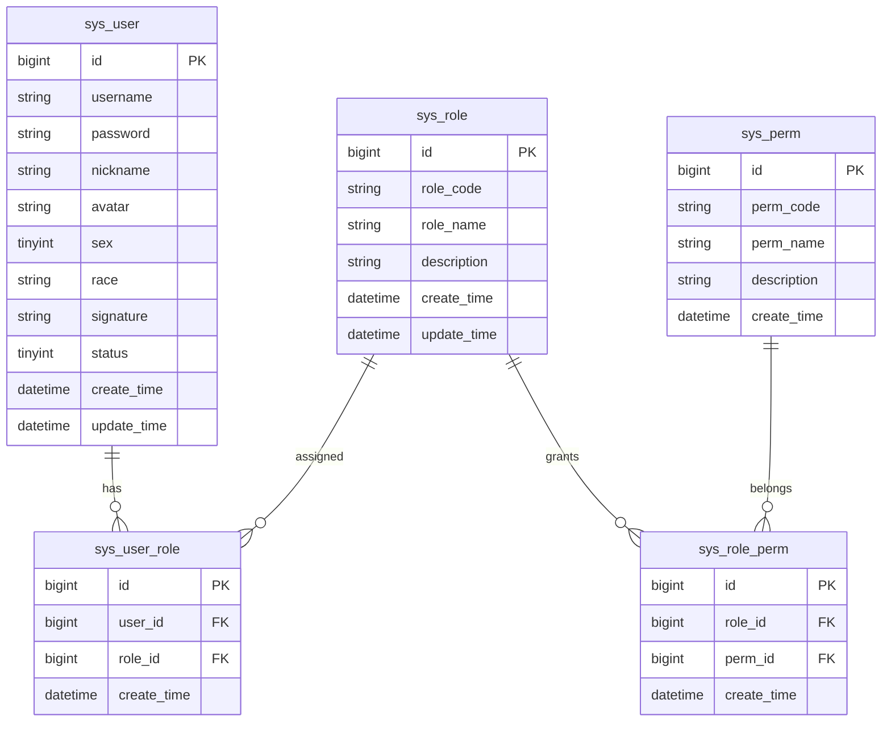
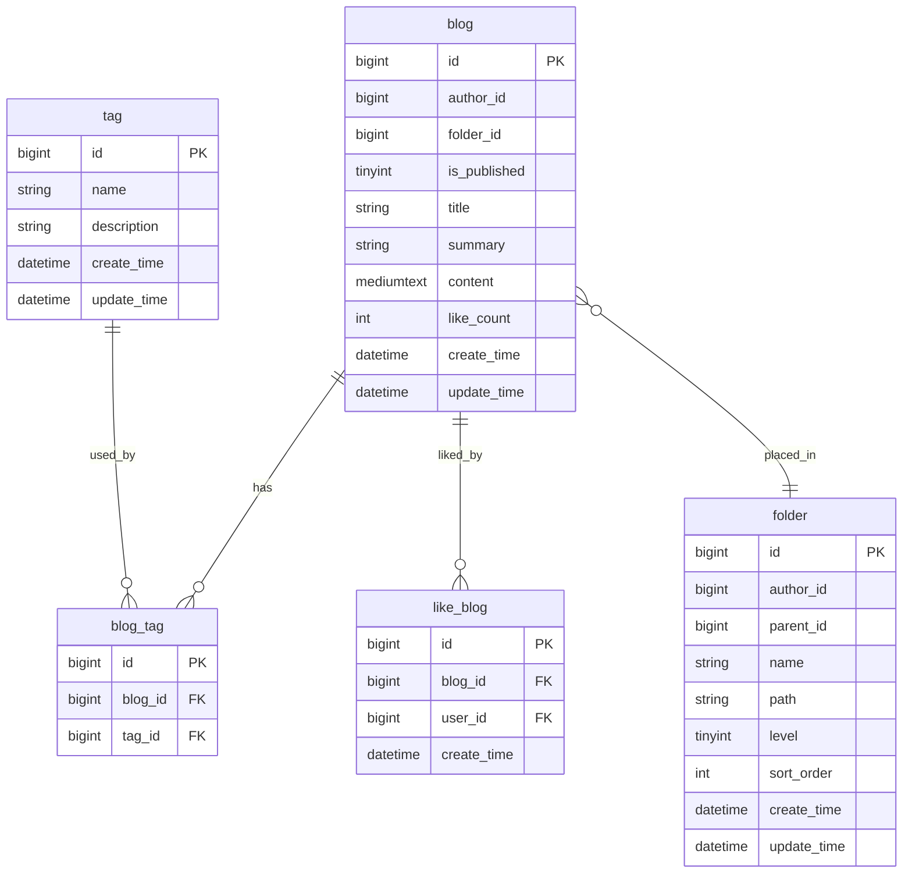

## 文档信息

| 项目 | 内容 |
| :--- | :--- |
| 产品名称 | 彼岸论坛 |
| 版本号 | v0.3.0 |
| 文档状态 | 发布前校对 |
| 作者 | Nobeta |
| 创建日期 | 2026-05-16 |
| 最后更新 | 2026-06-01 |

---

## 1. 背景目标

### 1.1 项目背景

v0.2 版本已经跑通用户认证、博客编写、公开浏览等核心链路，但后端结构、认证、缓存、文章组织方式仍有明显演进空间：

- 后端代码按横向包堆叠，业务边界不清晰。
- 认证逻辑分散，缺少统一鉴权入口与权限模型。
- Redis 只在局部使用，高频读写和 Token 状态缺少统一规划。
- 点赞、标签、目录等社区互动与内容组织能力不完整。
- 原“大标题/小标题”模型无法支撑笔记式工作台体验。

### 1.2 业务目标

v0.3.0 的目标是完成安全、缓存和内容组织基建：

1. **后端重构**：按业务模块拆分 Controller、Service、Mapper、DTO、VO、Entity。
2. **认证重构**：引入 Spring Security，采用 Access Token + Refresh Token。
3. **权限模型**：引入 RBAC 表结构，为普通用户和管理员权限扩展留口。
4. **Redis 集成**：承接 Token 状态、热点点赞状态、点赞变更流。
5. **目录系统**：用用户私有目录替换原“小标题”。
6. **Tag 系统**：用全局多标签替换原“大标题”。
7. **点赞系统**：实现博客点赞/取消点赞，并通过 Redis Stream 异步落库。
8. **前端适配**：新增工作台视图，分离公开阅读与个人编辑体验。

## 2. 用户角色说明

| 角色 | 描述 | 核心诉求 |
| --- | --- | --- |
| 访客 | 未登录用户 | 浏览首页、检索内容、访问公开博客 |
| 普通用户 | 注册并正常启用的用户 | 创作、编辑、管理个人博客；管理个人目录；点赞互动；修改个人资料 |
| 管理员 | 社区管理者 | 管理用户、处理违规内容、维护系统秩序 |

数据库中的角色码使用 `USER`、`ADMIN`。应用层组装 Spring Security 权限时再补充 `ROLE_` 前缀。

## 3. 功能清单

| 优先级 | 模块 | 功能点 | 描述 |
| --- | --- | --- | --- |
| P0 | 代码重构 | 分层与模块化 | 采用 `module/<domain>` 纵向切片，保留 `common`、`config`、`security` 等横切模块 |
| P0 | 安全认证 | Spring Security | 替换旧拦截器方案，统一认证、鉴权和异常响应 |
| P0 | 安全认证 | 双 Token | Access Token 短期访问，Refresh Token 刷新会话 |
| P0 | 权限 | RBAC | 用户、角色、权限、角色权限、用户角色五表 |
| P1 | 核心业务 | Tag 系统 | 全局标签，可搜索，可创建 |
| P1 | 核心业务 | 点赞系统 | 博客点赞 Toggle，Redis Lua 原子切换，Redis Stream 异步落库 |
| P1 | 性能基建 | Redis | Token 黑名单、登录用户缓存、点赞状态缓存、点赞变更流 |
| P2 | 核心业务 | 目录系统 | 用户私有目录树，支持创建、重命名、移动、删除、查询目录下博客 |
| P3 | 前端 | 工作台 | 用目录组织个人博客，公开详情和私有编辑详情分离 |

## 4. 数据模型

### 4.1 RBAC



初始角色：

| role_code | role_name | 说明 |
| --- | --- | --- |
| `USER` | 普通用户 | 默认注册用户 |
| `ADMIN` | 管理员 | 系统管理员 |

初始权限：

| perm_code | 说明 |
| --- | --- |
| `user:edit_profile` | 修改自己的个人资料 |
| `blog:manage_self` | 创建、编辑、删除自己的博客 |
| `folder:manage_self` | 创建、移动、删除自己的目录 |
| `like:blog` | 点赞或取消点赞博客 |
| `user:ban` | 管理员封禁用户 |
| `admin:manage` | 管理员系统管理权限 |

迁移要求：

- 既有 `user` 表重命名为 `sys_user`，移除旧锁定字段，新增 `status`。
- 既有用户必须全部补一条 `USER` 角色关系。
- `USER` 拥有个人资料、个人博客、个人目录、博客点赞权限。
- `ADMIN` 拥有 `USER` 权限，并额外拥有用户封禁、系统管理权限。

### 4.2 博客、目录、Tag、点赞



博客表变更：

- 删除旧 `bloguid` 与旧分类字段。
- `blog.id` 作为业务主键，新博客由应用层生成 Snowflake ID。
- 新增 `folder_id`，`0` 表示逻辑根目录。
- 新增 `like_count`，由异步落库任务按 `like_blog` 实际记录刷新。
- 同一作者同一目录下博客标题唯一。

目录表约束：

- `folder.id` 使用数据库自增主键。
- 目录为用户私有，通过 `author_id` 隔离。
- `parent_id = 0` 表示逻辑根目录。
- `path` 采用 `/{id}`、`/{parentId}/{id}` 形式，根目录本身不落表。
- 最大深度为 4 层。
- 同一作者同一父目录下子目录名称唯一。
- `sort_order` 已入表，v0.3.0 暂不提供排序修改接口。

Tag 表约束：

- Tag 全局共享，名称唯一。
- v0.3.0 支持查询和创建，不支持更新和删除。

点赞表约束：

- `like_blog` 保存最终点赞关系。
- `(blog_id, user_id)` 唯一，避免重复点赞。

## 5. 技术设计

### 5.1 项目结构

当前后端结构如下：

```text
src/main/java/online/faramita/bbs/
├── BbsApplication.java
├── common/
│   ├── constant/                    # AuthConstant, MessageConstant
│   ├── dto/                         # PageQuery
│   ├── enums/                       # ResultCode, RedisKeys
│   ├── exception/                   # BaseException, BusinessException
│   ├── result/                      # Result, PageResult
│   └── util/                        # SnowflakeUtil, GithubFileUtil
├── config/
│   ├── FileConfig.java
│   ├── JacksonConfig.java
│   ├── RedisConfig.java
│   ├── RedisScriptConfig.java       # 加载 redis/like_toggle.lua
│   ├── SpringDocConfig.java
│   └── properties/                  # JwtProperties, GithubProperties
├── handler/
│   └── GlobalExceptionHandler.java
├── security/
│   ├── SecurityConfig.java
│   ├── filter/JwtAuthenticationFilter.java
│   ├── handler/                     # 401/403 处理器
│   ├── service/UserDetailsServiceImpl.java
│   └── util/                        # TokenProvider, SecurityUtil, PasswordEncoderImpl
├── module/
│   ├── auth/                        # 登录、注册、刷新、登出、角色权限加载
│   ├── user/                        # 当前用户资料、公开资料、头像、密码
│   ├── blog/                        # 公开博客、个人博客、编辑保存
│   ├── folder/                      # 用户私有目录树
│   ├── tag/                         # 全局标签
│   ├── like/                        # 博客点赞
│   └── file/                        # 文件服务能力
└── task/
    ├── AvatarCleanupTask.java
    └── LikeFlushTask.java           # 点赞 Redis Stream 异步落库

src/main/resources/
├── application.yml
├── application-dev.yml.example
├── application-prod.yml.example
├── mapper/
│   ├── AuthMapper.xml
│   ├── UserMapper.xml
│   ├── BlogMapper.xml
│   ├── FolderMapper.xml
│   ├── TagMapper.xml
│   ├── LikeMapper.xml
│   └── FileMapper.xml
├── redis/
│   └── like_toggle.lua
└── sql/
    └── v0.3.0_init.sql
```

### 5.2 Redis 集成

v0.3.0 使用单机 Redis。应用层统一使用 Spring Data Redis：

- `RedisTemplate<String, Object>`：用户认证相关缓存。
- `StringRedisTemplate`：点赞 Set、Lua 执行、Redis Stream。

关键 Redis Key：

| Key | 类型 | TTL | 用途 |
| --- | --- | --- | --- |
| `token:blacklisted:{jti}` | String | Access Token 剩余有效期 | 登出后的 Access Token 黑名单 |
| `login_user:{userId}` | JSON | 1800s | 当前登录用户认证信息缓存 |
| `refresh_token:{userId}` | String | 604800s | Refresh Token 会话状态 |
| `like:blog:{blogId}` | Set | 86400s | 博客点赞用户集合 |
| `like:changelog:blog` | Redis Stream | 无 | 点赞变更流 |

### 5.3 安全认证

认证链路：

1. 登录成功后签发 Access Token 和 Refresh Token。
2. Refresh Token 存入 Redis，刷新时校验并轮换。
3. 登出时将 Access Token 的 `jti` 写入黑名单，并删除当前用户的 Refresh Token 和登录用户缓存。
4. `JwtAuthenticationFilter` 在 Spring Security 标准认证过滤器前执行。
5. 未认证访问受保护资源返回 401；权限不足返回 403。

公开接口：

- `POST /api/auth/login`
- `POST /api/auth/register`
- `POST /api/auth/refresh`
- `GET /api/users/{id}`
- `GET /api/tags`
- `GET /api/blogs/page`
- `GET /api/blogs/{id}`

受保护接口：

- `/api/auth/logout`
- `/api/users/me/**`
- `/api/folders/**`
- `POST /api/tags`
- `/api/blogs/me/**`
- `/api/like/**`

### 5.4 目录系统

目录系统采用邻接表 + 物化路径：

- 创建目录时先插入占位 path，再用生成的自增 ID 更新 path。
- 移动目录时校验目标父目录归属、深度、环路，然后批量更新子树 path 和 level。
- 删除目录不会删除博客；目录子树下的博客统一回到逻辑根目录 `folder_id = 0`。
- 查询目录树时读取当前用户所有目录，在 Service 层组装 `FolderTree`。
- 查询目录下博客时，只返回当前登录用户在该目录下的博客分页。

目录接口：

| 方法 | 路径 | 说明 |
| --- | --- | --- |
| `POST` | `/api/folders` | 创建目录 |
| `PUT` | `/api/folders/{id}` | 重命名目录 |
| `PUT` | `/api/folders/{id}/move` | 移动目录 |
| `DELETE` | `/api/folders/{id}` | 删除目录 |
| `GET` | `/api/folders/me` | 获取当前用户目录树 |
| `GET` | `/api/folders/{id}/blogs` | 获取当前目录下的博客 |
| `PUT` | `/api/folders/blogs/move` | 批量移动博客到目录 |

### 5.5 Tag 系统

Tag 为全局共享标签：

- `GET /api/tags` 支持分页和关键词搜索，公开访问。
- `POST /api/tags` 需要登录，创建成功返回 `TagBriefVO`。
- v0.3.0 不提供 Tag 更新、删除、后台审核能力。

### 5.6 点赞系统

点赞系统只覆盖博客，不覆盖评论或其他实体。

接口采用 Toggle 风格：

| 方法 | 路径 | 说明 |
| --- | --- | --- |
| `POST` | `/api/like/blogs/{id}` | 点赞或取消点赞，返回最新点赞数 |

Redis 设计：

- 点赞状态：`like:blog:{blogId}`，类型为 Set，成员为 `userId`。
- 点赞变更：`like:changelog:blog`，类型为 Redis Stream。
- Stream 字段：`blogId`、`userId`、`isLikeAction`、`timestamp`。
- Stream 写入使用 `XADD ... MAXLEN ~ 100000` 控制近似长度。

Lua Toggle 流程：

1. Service 校验博客存在。
2. 若 `like:blog:{blogId}` 不存在，从 `like_blog` 查询已有点赞用户回填 Set。
3. 执行 `redis/like_toggle.lua`：
   - `SISMEMBER` 判断当前用户是否已点赞。
   - 已点赞则 `SREM`，未点赞则 `SADD`。
   - 更新点赞 Set TTL。
   - `XADD like:changelog:blog` 写入变更事件。
   - `SCARD` 返回最新点赞数。

异步落库流程：

1. `LikeFlushTask` 每 60 秒执行一次，批量读取 50 条。
2. 消费组：`like-flush-group`。
3. 消费者：`like-flush-consumer`。
4. 优先读取 pending 消息，再读取新消息。
5. 同一批内按 `blogId:userId` 只保留最后一次操作。
6. `isLikeAction = true` 批量 `INSERT IGNORE INTO like_blog`。
7. `isLikeAction = false` 批量删除 `like_blog`。
8. 对受影响博客按 `like_blog` 实际记录刷新 `blog.like_count`。
9. 数据库写入成功后 ACK Stream 消息。

## 6. API 约定

接口详情以 `docs/FRMT BBS v0.3.0 API.md` 为准。

统一响应：

```json
{
  "code": 200,
  "msg": "操作成功",
  "data": {}
}
```

分页响应：

```json
{
  "total": 0,
  "pageNum": 1,
  "pageSize": 10,
  "pages": 0,
  "records": []
}
```

请求体约定：

- 普通业务写接口使用 `application/json`。
- 文件上传使用 `multipart/form-data`。
- Token 放在 `Authorization: Bearer <accessToken>`。
- 文档中的 API 路径不包含上下文路径；本地完整路径为 `/bbs` + API 路径。

## 7. 数据库迁移

v0.3.0 数据库迁移脚本为 `src/main/resources/sql/v0.3.0_init.sql`，需要覆盖：

- `user` 迁移为 `sys_user`。
- 新增 `sys_role`、`sys_perm`、`sys_user_role`、`sys_role_perm`。
- 初始化 `USER`、`ADMIN` 角色和权限。
- 为已有用户插入 `USER` 角色关系。
- 删除旧大小分类表，新增 `tag`、`folder`、`blog_tag`。
- 修改 `blog` 表字段，新增目录和点赞数。
- 新增 `like_blog`。

发布前必须在测试库验证脚本可重复执行的部分使用 `INSERT IGNORE` 或唯一约束保护，避免重复初始化导致失败。

## 8. 前端适配

前端新增“工作台”模块：

- `/workspace` 展示当前用户目录树、当前目录子目录、当前目录博客列表。
- `/workspace/blogs/{id}` 进入个人博客编辑详情。
- 公开博客详情与个人博客编辑详情分离：
  - `BlogPublicDetailView`：公开阅读、下载、点赞入口。
  - `BlogPrivateDetailView`：个人编辑和发布状态管理。

编辑器体验目标：

- 括号、方括号、花括号、反引号自动补全。
- 表格行列编辑能力优化。
- 支持标题级折叠。
- 增加字数统计。
