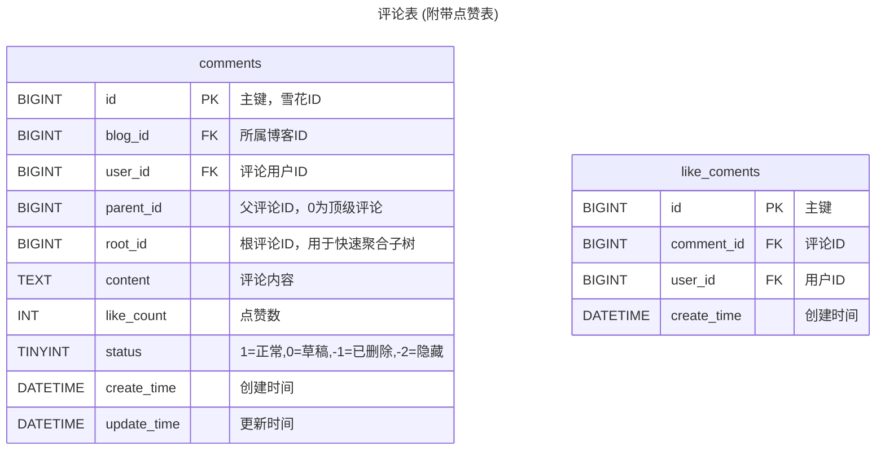
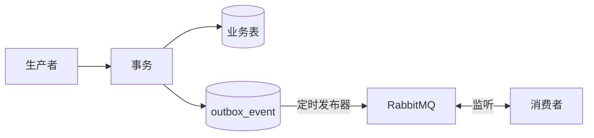
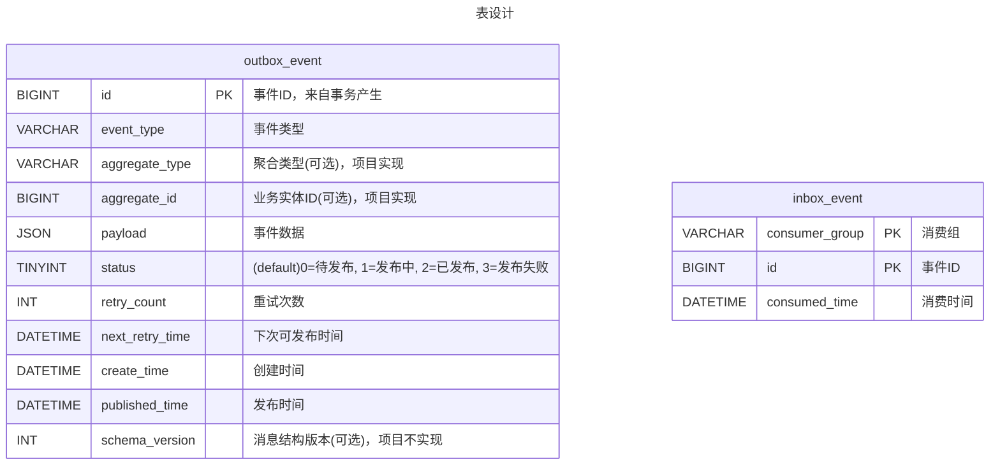

## 更新目标

- 引入评论系统
- 引入 Elasticsearch 作为搜索引擎
- 引入 RabbitMQ 作为消息队列

## 主要更新内容

### 1.1 评论核心

登陆用户可以在公开博客下进行评论和回复，支持两级展示。点赞异步使用消息队列异步落库。

### 1.2 搜索引擎

引入 Elasticsearch，对博客的标题、摘要、正文、作者昵称、标签、发布时间和点赞数建立索引。

只索引公开文章，取消发布和删除将产生移除事件。

Docker Compose 编排，需引入中文分词器与管理面板。

### 1.3 消息队列

引入 RabbitMQ 作为消息队列，定义事件机制。

MQ 在 v0.5.0 的用途如下：

- 改造点赞异步落库（like_blog, comment_blog）。
- 同步 Elasticsearch

## 技术说明

### 1.1 评论核心

> v0.5.0 管理模块暂不覆盖评论模块。

**数据库设计**

`blog` 表新增 `comments_count` 字段。



*索引设计：*

- `idx_blog_parent_create` : (`blog_id`, `parent_id`, `create_time`) —— 索引下推覆盖 (1)查询某博客下所有根评论按时间排序，或查询某根评论下的所有回复；(2)查询某博客的所有评论。
- `idx_user_id` : (`user_id`) —— 查询用户的评论历史。
- 点赞表唯一索引 `uk_comment_user` : (`comment_id`, `user_id`) 防止重复点赞。

提供新的接口

```http
# 查询博客评论列表
GET    /api/blogs/comments/{blogId}
# 创建评论
POST    /api/blogs/comments
# 点赞评论
POST /api/like/comments/{id}
# 删除评论
DELETE    /api/blogs/comments/{id}
```

### 1.2 分布式事务

#### 1.2.1 方案设计

> 栗子：博客的更新同时涉及 MySQL 和 RabbitMQ(Elasticsearch)。当博客更新时，需要完成(1)`UPDATE blog` 更新数据库；(2)MQ 发布博客更新消息，预期 Elasticsearch 接收消费完成博客数据的异库更新。

*MySQL 事务无法覆盖 RabbitMQ，因此不能使用 `@Transactional` 保证一致性，需要额外方案。*

***Outbox 解决方案：*** Outbox 是保存生产记录的容器，实现为在生产端数据库(MySQL)中的待发送事件表。业务事务在操作 MySQL 业务表的同时，向 `outbox_event` 表插入记录。两条 SQL 必然同时提交或者回滚，事务提交后，独立发布器读取 Outbox，并将事件推送到 Rabbit MQ。

***同一数据源事务可控性。*** *如果数据存储在 Redis 中，Outbox 也存储在 Redis ，用 Lua 脚本保持事务原子性。不同的服务持有各自的 Outbox 表，一般隔离。*



即，通过数据库可控的状态表 `outbox_event` 控制、处理分布式事务的推进。

- 独立发布器：查询待发送且到达(或超过)发布时间的记录，并将这些记录标记为发送中。随后推送 MQ。
- 发布成功回调：MQ ACK，将这些记录标记为已发送。
- 发布失败重试：发布失败后恢复记录待发送状态，修改下次发布时间。
- 消费重试与失败：RabbitMQ 默认重试5次，均失败后进入死信队列。

Outbox 方案保证消息进入 MQ（MQ Publisher ACK），但不保证消息之后的消费情况。通过 `status`与 `retry_count`、`next_retry_time` 控制 outbox 当前发布情况。

- **扫描**(1)`statu =0 AND retry_count=0` 正常初次投放记录；(2)`status=0 AND retry_count>0 AND next_retry_time<=NOW()` 发布失败重试记录；(3) `status=1 AND next_retry_time<=NOW()` 发送过程宕机，处理超时记录。
- 将扫描记录数据库更新 `status=1 AND next_retry_time = NOW() + WAIT_TIME`，**标记为发布中**。该过程为并发窗口，争抢 `status`和 `next_retry_time`记录，竞争成功才发布。
- 发布失败的记录超过**重试**次数则发布失败，否则增加重试次数并设置 `next_retry_time` 。*发布重试可以设置指数退避，避免大量同时重试。*

Outbox 方案无法保证消费端异常：

- **幂等**：消息重复投递，消费者会监听到重复任务。
- **有序**：旧消息自旋等待，晚于新消息抵达消费者，旧消息覆盖新消息。
- **最终消费**：Outbox 只能保证消息进入 MQ，不保证消息被消费者取出。

> RabbitMQ 推荐通过 Single Active Consumer 保持单队顺序，并行按聚合 ID 分区。分区执行窗口内无并发竞争异常。

**Inbox 解决方案：** Inbox 是保存消费记录的容器，实现为消费端数据库(MySQL)中的保存消费记录表。消费者在消费消息的同时，原子插入消费记录表。

- **幂等**：通过消费组(允许不同消费组消费同一消息)和消息ID作为幂等键，竞争插入记录。
- **有序**：通过单调版本属性(项目中使用自增雪花ID `event_id`)判断，消费者对同一聚合类型的修改只接受更高版本的修改。

消费者侧临时异常指数退避，永久异常直接进入 DLQ (死信队列)。

如果生产者需要消费者**最终消费**回调，需执行新一轮的 Outbox(原消费者)-Inbox(原生产者)。



*索引设计：* `idx_outbox_pending` : `(status, next_retry_time, create_time)`。

> *成功的 Outbox 需清理，防止记录无限增长。*

> [!note]
>
> v0.5.0 涉及分布式事务的业务：
>
> - 博客更新：MySQL(blog) —— Elasticsearch
> - 博客、点赞异步落库：Redis(缓存) —— MySQL(blog/comment, like)

#### 1.2.2 技术实现

业务模块不直接依赖 `RabbitTemplate`，而是封装 `DomainEventPublisher` 领域接口，并由 `OutboxDomainEventPublisher` 实现当前业务的 Outbox MQ 使用方案。

```java
public interface DomainEventPublisher {
        void publish(DomainEvent event);
}
// DomainEvent类
public class DomainEvent {
        private Long eventId;
        private String eventType;
        private String aggregateType;
        private Long aggregateId;
        private LocalDateTime createTime;
        private Object payload;
}
```

`OutboxDomainEventPublisher` 集中处理序列化、路由键、异常与重试，提高代码的可复用性。

```java
public class OutboxDomainEventPublisher implements DomainEventPublisher {
        @Override
        public void publish(DomainEvent event) {
             // ... 构造 OutboxEvent并插入数据库 ...
        }
        // 序列化
        private String serialize(DomainEvent event) {...}
}
```

业务 Service 在执行业务数据库操作时，如果需要推送 MQ，则调用 `outboxDomainEventPublisher` 事务写入 Outbox。由独立发布器 `OutboxPublisherTask` (项目采用定时任务消费)接触 RabbitMQ 消费。

> [!note]
>
> 项目中使用 `RedisOutboxPublisherTask` 处理 Redis 记录的 OutboxEvent。OutboxEvent 在 Redis 中存储时，需要使用 Hash (哈希存储 event 属性) 、 Zset (待处理队列，score 为 `retry_next_time` 有序排序方便比较)和ZSet(可选，失败队列，score为失败时间)联合存储。

```java
public class OutboxPublisherTask {
        private final RabbitTemplate rabbitTemplate;
        // 定时消费
        @Scheduled(fixedDelay = 1000)
        public void publishPendingEvents() {...}
}
```

消费者使用 `@RabbitListener` 监听队列变更消费，采用 RabbitMQ 配置的重试机制，均失败后消息进入死信队列。